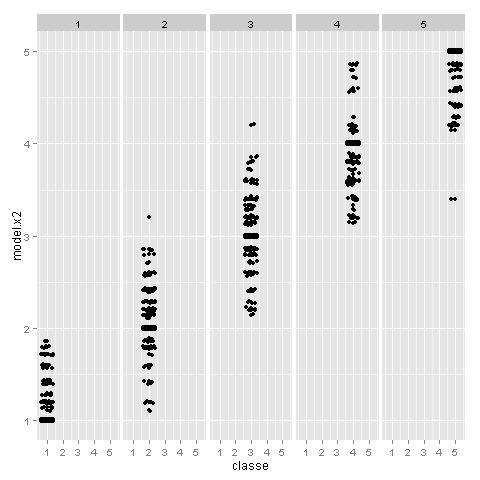

The goal of our Course Project is to predict the same manner like Groupware@LES in which they did the Human Activity Recognition process. Human Activity Recognition - has emerged as a key research area in the last years and is gaining increasing attention by the pervasive computing research community.

Groupware@LES proposed a dataset with 5 classes (sitting-down, standing-up, standing, walking, and sitting) collected on some hours of activities of 6 healthy subjects. This human activity recognition research has traditionally focused on discriminating between different activities, i.e. to predict "which" activity was performed at a specific point in time. The approach we propose for the Weight Lifting Exercises dataset is to investigate "how (well)" an activity was performed by the wearer.

In this work we will try to make the same steps and received the same result as  Groupware@LES. 

More information of Groupware@LES result  is available from the website here: http://groupware.les.inf.puc-rio.br/har. 
The training data for this project are available here: https://d396qusza40orc.cloudfront.net/predmachlearn/pml-training.csv
The test data are available here: https://d396qusza40orc.cloudfront.net/predmachlearn/pml-testing.csv

According to the description of the Course Project complete R code should not be provided with data describing the results of the calculations.

So letТs start step by step:

## Formulation of idea

So, in order to achieve the same result, as colleagues from  Groupware@LES group, clean received training Assembly from NA and null columns. All designation of a classes we will transform to numeric values.

Take 10 appropriate methods for training our model on the training Assembly.

As we result we will received 10 different predictions results. Assume that all 10 results will be not Уthe bestФ  and we will need to proceed one more training operation  on the 10 result set. It will help us to reduce the variation in results and to improve the accuracy of the forecast. 

## So let's check the idea.

Choose 10 right methods from the existing 180, clear learning Assembly from the zero column and start the learning process. As the result we are receiving the next picture.

All results are given in percent.

As expected, the range of models results is quite strong. Now apply the training results received by the method "knn" (as an option).

As a result of applying re-training results improved significantly. I honestly didn't expect that a training example can reach a very good result with a probability of 99%++. Thus it was possible to follow by the same path as the Groupware@LES group, and get a decent result.

Special note is the using of multi-threaded calculations. Without using this package, the result would have been much later.

Thanks a lot for your time!

